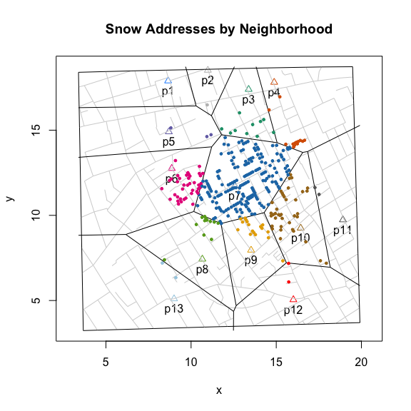

<!-- README.md is generated from README.Rmd. Please edit that file -->
### cholera: amend, augment and aid analysis of John Snow's 1854 cholera data

John Snow's map of the 1854 cholera outbreak in London's Soho is one of the best known examples of data visualization and information design. As evidence of his claim that cholera is a waterborne rather than airborne disease, Snow plots the water pumps, the primary source of drinking water in 1854, and the location and count of cholera fatalities as stacks of horizontal bars:


While the map shows a concentration of fatalities around the Broad Street pump, which Snow suspected was the source of the cholera, it actually doesn't do the best job of excluding rival explanation. The pattern we see is not clearly different from what airborne transmission might look like. To address this problem, Snow added a graphical annotation to a second, lesser-known version of the map that was published in the official report on the outbreak:


### pump neighborhoods

This annotation outlines the Broad Street *pump neighborhood*, the residences Snow claims are within "close" walking distance to the pump. What makes the notion of a pump neighborhood so important is that it provides a very specific (testable) prediction about the spatial distribution of cases: if water is cholera's mode of transmission and and if water pumps located on the street are the primary source of drinking water, then most, if not all fatalities should be found *within* the neighborhood. The disease should stop at the neighborhood's borders. In this way, pump neighborhoods can help distinguish waterborne from airborne patterns of disease transmission.

To that end, this package builds on Snow's work by offering two systematic ways of computing pump neighborhoods. Doing so not only provides a way to replicate and validate Snow's efforts, it also allows you to explore and investigate the data for yourself. You can compute all or any selection of pump neighborhoods. By identifying which cases belongs to which neighborhood, you can explore different scenarios and hypotheses, like the possibility that the choice of pump is affected by water quality.

The first approach uses Voronoi tessellation. It works by computing the Euclidean distances between pumps. While popular and easy to compute, its only drawback is that roads and walking distance play no role in the choice of pump. The method assumes that people can walk through walls to get to their preferred pump.

``` r
library(cholera)
plot(neighborhoodVoronoi())
```



The second approach, which follows Snow's lead, computes neighborhoods based on the "actual" walking distance along the streets of Soho. While more accurate, it is harder to compute than Voronoi tessellation. To do the computations, I wrote functions that transform the roads on the map into a "social" graph. This turns the computation of walking distance into a graph theory problem: for a given case (observed or simulated), I compute the shortest weighted path to the nearest pump:

``` r
walkingPath(150)
```


Then, by applying the "rinse and repeat" principle, the different pump neighborhoods emerge:

``` r
plot(neighborhoodWalking())
```


To explore scenarios like the effect of water quality mentioned above, you can simply exclude the pump with low quality to see how the spatial distribution of cases is affected:

``` r
plot(neighborhoodWalking(-6))
```


### other package features

-   Fixes three apparent coding errors in Dodson and Tobler's 1992 digitization of Snow's map.
-   "Unstacks" the data in two ways to improve analysis and visualization.
-   Adds the ability to overlay graphical features like kernel density, Voronoi diagrams, and notable landmarks (John Snow's residence, the Lion Brewery, etc.).
-   Includes a variety of helper functions to find and locate cases, roads, pumps and walking paths.
-   Appends street names to the roads data.
-   Includes the revised pump data used in the second version of Snow's map from the Vestry report.
-   Adds two different aggregate time series fatalities data from the Vestry report.

### getting started

To install "cholera", use the expression below. Note that you may need to install the "devtools" package.

``` r
# install.packages("devtools")
devtools::install_github("lindbrook/cholera", build_vignettes = TRUE)
```

Besides the help pages, the vignettes include detailed discussion about the data and functions:

``` r
vignette("duplicate.missing.cases")
vignette("unstacking.fatalities")
vignette("pump.neighborhoods")
vignette("roads")
vignette("time.series")
```

### note

neighborhoodWalking() is computationally intensive (1-2 minutes on a single core). To improve performance, seven basic configurations have been pre-computed (for details, see neighborhoodWalking()'s Help Page) and a parallel, multi-core implementation is available on Linux and Mac.
